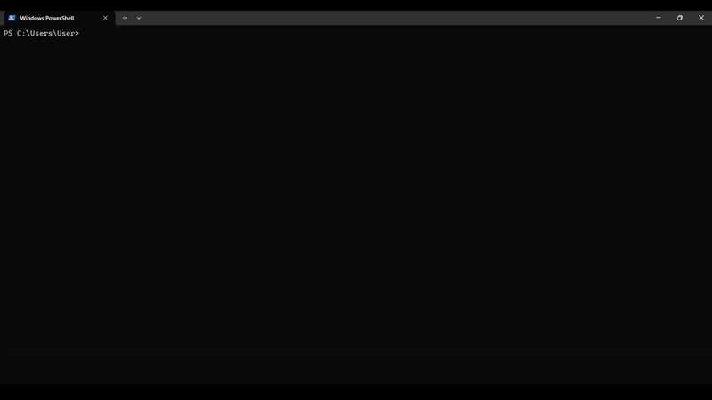
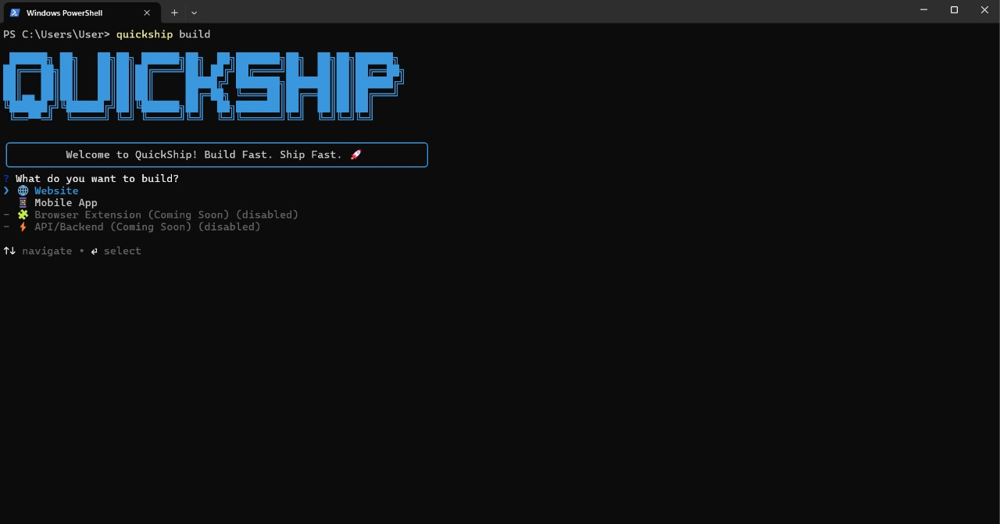

<div align="center">
  

  # QuickShip CLI ⚡

  ### Ship production-ready projects in 60 seconds

[](https://www.npmjs.com/package/quickship-cli)
[](LICENSE)
[](https://nodejs.org)

**Stop wasting hours on boilerplate.** Create production-ready web and mobile apps with TypeScript, Tailwind CSS, and modern tooling - fully configured in under 60 seconds.

[Getting Started](#-getting-started) • [Templates](#-templates) • [Commands](#-commands) • [Deploy](#-deployment)

</div>

---

## 🎥 See It In Action

<div align="center">
  
  <p><em>Create production-ready projects in 60 seconds</em></p>

  <br>

  
  <p><em>Wide range of templates: Web, Mobile, and Backend with flexible database options</em></p>
</div>

---

## 🎯 Why QuickShip?

| Traditional Setup | With QuickShip |
|-------------------|----------------|
| ❌ 30-60 minutes setup | ✅ **60 seconds** |
| ❌ Manual configuration | ✅ **Fully automated** |
| ❌ Version conflicts | ✅ **Latest stable versions** |
| ❌ Missing best practices | ✅ **Production-ready** |
| ❌ Complex deployment | ✅ **One command deploy** |

---

## 🚀 Getting Started

### Installation

**Option 1: No Installation (Recommended)**

Use `npx` to run QuickShip without installing:

```bash
npx quickship-cli@latest build my-app
```

**Option 2: Global Install**

Install once, use everywhere:

```bash
npm install -g quickship-cli
```

---

### Basic Usage

The simplest way to create a project:

```bash
quickship build my-app
```

QuickShip will ask you a few questions and create your project. That's it!

**What you get:**
- ✅ TypeScript configured
- ✅ Tailwind CSS ready
- ✅ Git initialized
- ✅ Dependencies installed
- ✅ ESLint + Prettier setup
- ✅ Development server ready

**Then start coding:**

```bash
cd my-app
npm run dev
```

Your app is now running! 🎉

---

### Skip the Questions (Headless Mode)

Want to skip all prompts? Use the `-y` flag:

```bash
# Uses sensible defaults (Next.js, TypeScript, Tailwind, npm, Git)
quickship build my-app -y
```

---

### Advanced Usage

Customize with flags:

```bash
# Specify template
quickship build my-app --template nextjs -y

# Choose package manager
quickship build my-app -p pnpm -y

# Skip Git initialization
quickship build my-app --no-git -y

# Skip dependency installation (for CI/CD)
quickship build my-app --no-install -y

# Combine options
quickship build my-app --template vite -p yarn --no-git -y
```

**Available flags:**

| Flag | Description | Example |
|------|-------------|---------|
| `-y, --yes` | Skip all prompts | `quickship build my-app -y` |
| `-t, --template <n>` | Choose template | `--template nextjs` |
| `-p, --package-manager <pm>` | Choose package manager | `-p pnpm` |
| `--no-git` | Skip Git initialization | `quickship build my-app --no-git` |
| `--no-install` | Skip installing dependencies | `quickship build my-app --no-install` |
| `-v, --verbose` | Show detailed logs | `quickship build my-app -v` |

---

## 🚀 Templates

Choose from **6 production-ready templates** for web, mobile, and backend:

### 🌐 Web Development

<table>
<tr>
<td width="33%">

#### Next.js
*Recommended*

Full-stack React framework with server components and API routes.

**Stack:**
- Next.js 15+
- React 19
- TypeScript
- Tailwind CSS
- App Router

```bash
quickship build my-app \
  --template nextjs -y
```

</td>
<td width="33%">

#### T3 Stack

Type-safe full-stack with tRPC, Prisma, and NextAuth.

**Stack:**
- Next.js
- tRPC
- Prisma
- NextAuth
- TypeScript
- Tailwind CSS

```bash
quickship build my-app \
  --template t3-stack -y
```

</td>
<td width="34%">

#### React + Vite

Lightning-fast React SPA development.

**Stack:**
- React 18+
- Vite 7+
- TypeScript
- Tailwind CSS v4
- React Router

```bash
quickship build my-app \
  --template vite -y
```

</td>
</tr>
</table>

#### MERN Stack

Full-stack with MongoDB, Express, React, and Node.js.

**Stack:** MongoDB • Express • React • Node.js • TypeScript • Tailwind CSS

```bash
quickship build my-app --template mern-stack -y
```

### 📱 Mobile Development

#### Expo React Native

Cross-platform mobile apps for iOS, Android, and Web.

**Stack:** Expo SDK 52+ • React Native • TypeScript • Expo Router

**Features:**
- 📂 Tabs or Blank template
- 🎨 StyleSheet (default) or NativeWind (Tailwind CSS)
- 🧭 File-based routing with Expo Router
- 📱 Test instantly with Expo Go
- 🌐 Runs on iOS, Android, and Web

```bash
quickship build my-app --template expo-react-native -y
```

### 🔌 Backend / API Development

#### Express + TypeScript API
*Recommended*

Fast, flexible RESTful API with TypeScript and **optional** ORM/ODM.

**Stack:** Express.js • TypeScript • Your Choice of Database & ORM • JWT Auth (optional) • Swagger (optional)

**Features:**
- 🚀 Express.js 4+ with TypeScript
- 💾 **Flexible Database Options:**
  - PostgreSQL (with Prisma ORM or raw `pg` driver)
  - MongoDB (with Mongoose ODM or raw `mongodb` driver)
  - SQLite (with Prisma ORM or `better-sqlite3`)
  - No database (API only)
- 🔐 JWT Authentication (optional, requires database)
- 📚 Swagger API Documentation (optional)
- 🐳 Docker Support (optional)
- ✅ Zod Validation
- 🧪 Jest Testing

```bash
quickship build my-api --template express-api -y
```

#### NestJS API

Enterprise-grade API with modular architecture, dependency injection, and **optional** ORM/ODM.

**Stack:** NestJS • TypeScript • Your Choice of Database & ORM • Passport.js Auth (optional) • Swagger (optional)

**Features:**
- 🏗️  NestJS 10+ with TypeScript
- 💾 **Flexible Database Options:**
  - PostgreSQL (with Prisma ORM or raw `pg` driver)
  - MongoDB (with Mongoose ODM or raw `mongodb` driver)
  - SQLite (with Prisma ORM or `better-sqlite3`)
  - No database (API only)
- 🔐 Passport.js + JWT Authentication (optional, requires database)
- 📚 Swagger API Documentation (auto-generated, optional)
- 🐳 Docker Support (optional)
- ✅ Class Validator & DTOs
- 🧪 Jest Testing with NestJS utilities

```bash
quickship build my-api --template nestjs-api -y
```

---

## 🛠️ Commands

### Core Commands

```bash
# Create a new project (interactive)
quickship build

# Create with a name (interactive)
quickship build my-app

# Create with defaults (no prompts)
quickship build my-app -y

# List all available templates
quickship list

# Add features to existing project
quickship add <feature>
```

### Project Management

```bash
# Show detailed project information
quickship info

# Check project and environment health
quickship doctor

# View all templates with details
quickship templates

# Update CLI to latest version
quickship update
```

### Deployment

```bash
# Deploy to production (interactive)
quickship deploy

# Deploy to specific platform
quickship deploy --platform vercel

# Skip confirmations
quickship deploy -y
```

### Get Help

```bash
# Show all commands
quickship --help

# Show help for specific command
quickship build --help

# Show CLI version
quickship --version
```

---

## 🚢 Deployment

Deploy your project with a single command:

```bash
cd my-app
quickship deploy
```

**Supported Platforms:**

| Platform | Best For | Features |
|----------|----------|----------|
| **Vercel** | Next.js, T3 Stack, Express, NestJS | Zero-config, Edge functions, Serverless, CI/CD |
| **Netlify** | Vite, React, Next.js | Fast CDN, Deploy previews, Forms, Functions |

**What it does:**
- 🔍 Auto-detects your project type
- ✅ Validates build setup
- 🔐 Handles platform authentication
- 🔑 Manages environment variables
- 🚀 Deploys to production
- 🌐 Returns live URL

---

## ✨ Features

### Add Features After Creation

Enhance your Next.js projects:

```bash
cd my-app

# Add shadcn/ui components
quickship add shadcn

# Add NextAuth.js authentication
quickship add auth

# Add Prisma database
quickship add database
```

### Health Check

Verify your environment and project setup:

```bash
quickship doctor
```

**Checks:**
- Node.js version
- Package managers
- Git installation
- Project structure
- Dependencies
- Environment variables
- TypeScript config

### Project Info

Get detailed project information:

```bash
quickship info
```

**Shows:**
- Project type
- Tech stack
- Available commands
- Features to add

---

## 📚 Examples

### Example 1: Quick Next.js App

```bash
# Fastest way - uses defaults
quickship build my-saas -y

cd my-saas
npm run dev
# ✨ App running at http://localhost:3000
```

### Example 2: Interactive Setup

```bash
# Answer a few questions
quickship build my-app

# QuickShip asks:
# ? What do you want to build? Website
# ? Choose your stack: Next.js
# ? Add shadcn/ui? Yes
# ? Package manager: npm
# ? Initialize Git? Yes

cd my-app
npm run dev
```

### Example 3: Add Features After Creation

```bash
# Create a basic Next.js app
quickship build my-saas -y

cd my-saas

# Add shadcn/ui components
quickship add shadcn

# Add authentication with NextAuth.js
quickship add auth

# Add database with Prisma
quickship add database

# ✨ Now you have a full-stack app with auth and database!
npm run dev
```

### Example 4: MERN Stack with Custom Options

```bash
# Full control with flags
quickship build my-api \
  --template mern-stack \
  -p pnpm \
  -y

# Configure MongoDB
cd my-api/server
cp .env.example .env
# Edit .env with your MongoDB URI

# Run both client and server
cd ..
pnpm dev
```

### Example 5: Mobile App

```bash
# Create Expo app
quickship build my-mobile-app

# Choose:
# ? What do you want to build? Mobile App
# ? Choose mobile stack: Expo React Native
# ? Choose template: Tabs
# ? Styling: StyleSheet

cd my-mobile-app
npx expo start

# Scan QR code with Expo Go app! 📱
```

### Example 6: Deploy to Production

```bash
# Create app
quickship build my-next-app -y

cd my-next-app

# Deploy in one command
quickship deploy --platform vercel

# ✨ Your app is live!
```

### Example 7: CI/CD Pipeline

```bash
# Perfect for automated deployments
quickship build production-app \
  --template nextjs \
  -p npm \
  --no-git \
  -y

cd production-app
npm run build
npm run start
```

---

## 🎯 Comparison

| Feature | QuickShip | create-next-app | create-vite | create-expo-app |
|---------|-----------|-----------------|-------------|-----------------|
| **Web Templates** | ✅ 4 templates | ✅ 1 | ✅ Many | ❌ |
| **Mobile Templates** | ✅ Expo | ❌ | ❌ | ✅ 1 |
| **Backend Templates** | ✅ 2 APIs | ❌ | ❌ | ❌ |
| **TypeScript** | ✅ Default | ✅ Optional | ✅ Optional | ✅ Optional |
| **Tailwind CSS** | ✅ Pre-configured | ❌ Manual | ❌ Manual | ❌ Manual |
| **Deployment** | ✅ One command | ❌ Manual | ❌ Manual | ❌ Manual |
| **Add Features** | ✅ CLI commands | ❌ Manual | ❌ Manual | ❌ Manual |
| **Health Check** | ✅ Built-in | ❌ | ❌ | ❌ |
| **Project Info** | ✅ Built-in | ❌ | ❌ | ❌ |

---

## 💻 Requirements

- **Node.js:** 18.0.0 or higher
- **npm:** 9.0.0 or higher (or pnpm, yarn, bun)
- **Git:** Any recent version (optional)
- **OS:** Windows, macOS, or Linux

---

## 🗺️ Roadmap

### ✅ Released (v0.10)
- ✅ Next.js, Vite, T3 Stack, MERN templates
- ✅ Expo React Native mobile development
- ✅ shadcn/ui integration
- ✅ NextAuth.js integration (`quickship add auth`)
- ✅ Prisma database integration (`quickship add database`)
- ✅ One-command deployment (Vercel, Netlify, Railway, Render)
- ✅ Health check and project info
- ✅ Headless mode for CI/CD

### ✅ Released (v1.0.0) - 🎉 PRODUCTION READY
- ✅ **Backend API Templates** - Express & NestJS
- ✅ **Optional ORM/ODM** - Choose database first, then optionally add Prisma/Mongoose or use raw drivers
- ✅ **6 Database Configurations** - PostgreSQL, MongoDB, SQLite (each with ORM or raw driver options)
- ✅ **No Database Option** - Build APIs without database dependencies
- ✅ Express.js + TypeScript API with flexible database choices
- ✅ NestJS API with modular architecture and dependency injection
- ✅ JWT Authentication & Swagger documentation (optional)
- ✅ Docker support for APIs (optional)
- ✅ Auto-generated `.env` files - Projects work immediately after creation
- ✅ Fixed NestJS MongoDB dependency injection issues
- ✅ Improved platform selection order and UX

### 🚀 Coming Soon (v1.1+)
- 🔜 More Expo templates (drawer, stack navigation)
- 🔜 Supabase integration
- 🔜 Component generator
- 🔜 More auth provider integrations (Clerk, Auth0)
- 🔜 More database integrations (PlanetScale, Supabase)
- 🔜 Astro, SvelteKit, Remix templates

### 🌟 Future (v1.2+)
- Browser extension templates
- Desktop app templates (Electron, Tauri)
- Visual project builder
- Custom template marketplace
- Team collaboration features

---

## 🤝 Contributing

Contributions are welcome! Here's how you can help:

1. **Star this repo** ⭐ - Show your support
2. **Report bugs** 🐛 - [Open an issue](https://github.com/SeifElkadyy/QuickShip-CLI/issues)
3. **Request features** 💡 - [Start a discussion](https://github.com/SeifElkadyy/QuickShip-CLI/discussions)
4. **Submit PRs** 🔧 - Fork, code, and submit

### Development Setup

```bash
# Clone the repo
git clone https://github.com/SeifElkadyy/QuickShip-CLI.git
cd QuickShip-CLI

# Install dependencies
npm install

# Link for local testing
npm link

# Test it out
quickship build test-app
```

---

## 📝 License

MIT License - see [LICENSE](LICENSE) file for details.

---

## 🙏 Acknowledgments

Built with these amazing tools:
- [Commander.js](https://github.com/tj/commander.js) - CLI framework
- [Inquirer.js](https://github.com/SBoudrias/Inquirer.js) - Interactive prompts
- [Chalk](https://github.com/chalk/chalk) - Terminal styling
- [Ora](https://github.com/sindresorhus/ora) - Spinners
- [Boxen](https://github.com/sindresorhus/boxen) - Boxes
- [execa](https://github.com/sindresorhus/execa) - Process execution

Inspired by create-next-app, create-t3-app, create-vite, and create-expo-app.

---

## 💖 Support QuickShip

QuickShip is **free and open-source**. If it saves you time:

<div align="center">

[](https://github.com/SeifElkadyy/QuickShip-CLI)

**Support development:**

<a href="https://paypal.me/destoyt">
  
</a>

**Your support helps:**
- 🚀 Add more templates
- 🐛 Fix bugs faster
- ✨ Build new features
- 📚 Improve documentation

</div>

---

## 📞 Get Help

- **Issues:** [Report bugs or request features](https://github.com/SeifElkadyy/QuickShip-CLI/issues)
- **Discussions:** [Ask questions and share ideas](https://github.com/SeifElkadyy/QuickShip-CLI/discussions)
- **NPM:** [Package information](https://www.npmjs.com/package/quickship-cli)

---

<div align="center">

**Built with ❤️ for developers who want to ship fast**

[Get Started](#-getting-started) • [View Templates](#-templates) • [Commands](#-commands)

**Version 1.0.0** | **MIT License**

</div>