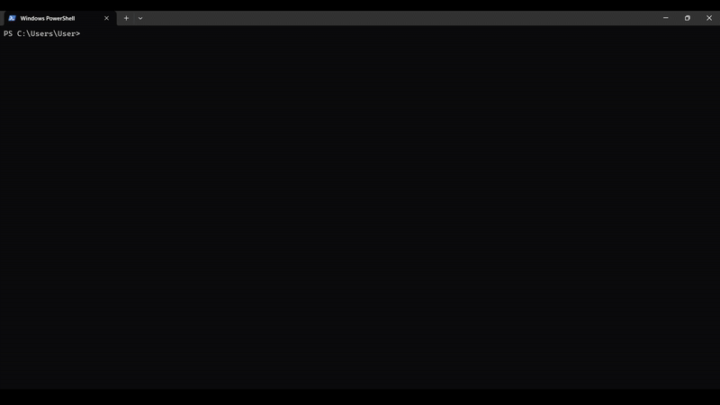
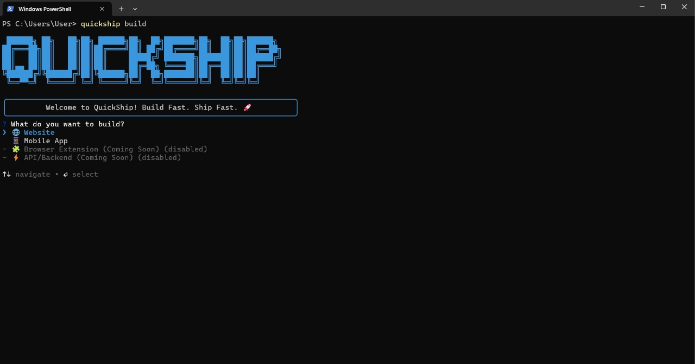

<div align="center">
  

  # QuickShip CLI ⚡

  ### Ship production-ready projects in 60 seconds

[](https://www.npmjs.com/package/quickship-cli)
[](https://github.com/SeifElkadyy/QuickShip-CLI/actions)
[](LICENSE)
[](https://nodejs.org)

**Stop wasting hours on boilerplate.** Create production-ready web, mobile, and backend apps with TypeScript, Tailwind CSS, and modern tooling — fully configured in under 60 seconds.

[Getting Started](#-getting-started) • [Templates](#-templates) • [Commands](#-commands) • [Deploy](#-deployment)

</div>

---

## 🎥 See It In Action

<div align="center">
  
  <p><em>Create production-ready projects in 60 seconds</em></p>

  <br>

  
  <p><em>Web, Mobile, and Backend templates with flexible database options</em></p>
</div>

---

## 🎯 Why QuickShip?

| Traditional Setup | With QuickShip |
|-------------------|----------------|
| ❌ 30–60 minutes of setup | ✅ **60 seconds** |
| ❌ Manual config files | ✅ **Fully automated** |
| ❌ Version conflicts | ✅ **Latest stable versions** |
| ❌ Missing best practices | ✅ **Production-ready** |
| ❌ Complex deployment | ✅ **One command deploy** |

---

## 🚀 Getting Started

### Installation

**Option 1: No installation (recommended)**

```bash
npx quickship-cli@latest build my-app
```

**Option 2: Global install**

```bash
npm install -g quickship-cli
```

---

### Basic usage

```bash
quickship build my-app
```

QuickShip prompts a few questions and creates your project. That's it.

**What you get:**
- ✅ TypeScript configured
- ✅ Tailwind CSS ready
- ✅ Git initialized with initial commit
- ✅ Dependencies installed
- ✅ Development server ready
- ✅ shadcn/ui (if selected) — fully initialized

```bash
cd my-app
npm run dev
```

---

### Smart suggestions

QuickShip analyzes your project name and pre-selects the best stack:

```bash
quickship build my-saas-dashboard   # → suggests Next.js + shadcn/ui
quickship build my-shop             # → suggests T3 Stack (auth + DB)
quickship build my-rest-api         # → suggests Express API
quickship build my-admin-panel      # → suggests React + Vite SPA
```

---

### Skip the questions (headless mode)

```bash
# Uses sensible defaults (Next.js, TypeScript, Tailwind, npm, Git)
quickship build my-app -y
```

---

### CI/CD mode

QuickShip **auto-detects CI environments** (GitHub Actions, CircleCI, Railway, etc.) and runs fully non-interactively — no flags needed:

```bash
# In GitHub Actions / any CI — prompts are skipped automatically
quickship build my-app --template nextjs --no-install --no-git
```

---

### Team config file

Commit a `.quickshiprc.json` to your repo so every developer gets the same defaults:

```json
{
  "packageManager": "pnpm",
  "git": true
}
```

QuickShip picks it up automatically via `cosmiconfig` — supports `.quickshiprc`, `.quickshiprc.json`, `quickship.config.js`, or a `quickship` key in `package.json`.

---

### Advanced flags

```bash
quickship build my-app --template nextjs -y          # specific template
quickship build my-app -p pnpm -y                    # choose package manager
quickship build my-app --no-git -y                   # skip git
quickship build my-app --no-install -y               # skip npm install
quickship build my-app --ascii                       # classic ASCII logo
```

**All flags:**

| Flag | Description |
|------|-------------|
| `-y, --yes` | Skip all prompts, use defaults |
| `-t, --template <name>` | Choose template directly |
| `-p, --package-manager <pm>` | `npm` / `pnpm` / `yarn` / `bun` |
| `--no-git` | Skip Git initialization |
| `--no-install` | Skip dependency installation |
| `--ascii` | Show classic ASCII logo |
| `-v, --verbose` | Show detailed logs |

---

## 🚀 Templates

### 🌐 Web

<table>
<tr>
<td width="33%">

#### Next.js
*Recommended*

Full-stack React with server components and API routes.

- Next.js 16
- React 19
- TypeScript
- Tailwind CSS v4
- App Router

```bash
quickship build my-app \
  --template nextjs -y
```

</td>
<td width="33%">

#### T3 Stack

Type-safe full-stack with tRPC, Prisma, NextAuth.

- Next.js
- tRPC
- Prisma
- NextAuth
- TypeScript

```bash
quickship build my-app \
  --template t3-stack -y
```

</td>
<td width="34%">

#### React + Vite

Fast SPA development.

- React 18+
- Vite 7+
- TypeScript
- Tailwind CSS v4

```bash
quickship build my-app \
  --template react-vite -y
```

</td>
</tr>
</table>

#### MERN Stack

Full-stack MongoDB + Express + React + Node.js with TypeScript.

```bash
quickship build my-app --template mern-stack -y
```

---

### 📱 Mobile

#### Expo React Native

Cross-platform iOS, Android, and Web.

- Expo SDK 52+
- React Native + TypeScript
- Expo Router (file-based routing)
- StyleSheet or NativeWind (Tailwind CSS)

```bash
quickship build my-app --template expo-react-native -y
```

---

### 🔌 Backend / API

#### Express + TypeScript API

Fast REST API with flexible database options.

- Express.js + TypeScript
- PostgreSQL / MongoDB / SQLite / None
- Prisma ORM or raw drivers (your choice)
- JWT auth (optional)
- Swagger docs (optional)
- Docker (optional)

```bash
quickship build my-api --template express-api -y
```

#### NestJS API

Enterprise-grade modular API.

- NestJS 10+ + TypeScript
- Same database options as Express
- Passport.js + JWT (optional)
- Swagger auto-generated (optional)
- Docker (optional)

```bash
quickship build my-api --template nestjs-api -y
```

---

## 🛠️ Commands

```bash
# Create a new project
quickship build [project-name]

# List all available templates
quickship list

# Show detailed template info
quickship templates

# Add features to existing project
quickship add shadcn
quickship add auth          # prompts for Clerk / Supabase / NextAuth
quickship add auth --provider clerk
quickship add database

# Check environment + project health
quickship doctor

# Show project info
quickship info

# Deploy to production
quickship deploy
quickship deploy --platform vercel

# Update CLI
quickship update

# Help
quickship --help
quickship build --help
```

---

## 🚢 Deployment

```bash
cd my-app
quickship deploy
```

| Platform | Best For |
|----------|----------|
| **Vercel** | Next.js, T3 Stack, Express, NestJS |
| **Netlify** | Vite, React, Next.js |
| **Railway** | MERN Stack, APIs |
| **Render** | MERN Stack, APIs |

---

## ✨ Add Features

```bash
cd my-app

quickship add shadcn      # shadcn/ui component library
quickship add auth        # authentication (Clerk / Supabase / NextAuth)
quickship add database    # Prisma database
```

| Auth Provider | Best For |
|--------------|----------|
| **Clerk** | Quick MVPs — pre-built UI, user management |
| **Supabase** | Full-stack — auth + PostgreSQL + storage |
| **NextAuth** | Custom flows — maximum flexibility |

---

## 🧪 Testing

```bash
npm test              # all tests (unit + integration)
npm run test:unit     # unit tests only
npm run test:integration  # scaffold + CLI integration tests
npm run test:coverage # coverage report
```

**75 tests** covering:
- Project name validation + path traversal protection
- Smart stack suggestions
- Git isolation (prevents parent-repo detection)
- Config file loading
- No-op spinner (zero stdout bleed into listr2)
- Full scaffold: Next.js + Vite, CI mode, input rejection

---

## 💻 Requirements

- **Node.js:** 20.12.0 or higher
- **npm:** 9.0.0 or higher (or pnpm, yarn, bun)
- **Git:** Any recent version (optional)
- **OS:** Windows, macOS, or Linux

---

## 🗺️ Roadmap

### ✅ v1.0.0 — Production ready
- Next.js, Vite, T3 Stack, MERN templates
- Express + NestJS API templates with flexible DB options
- Expo React Native mobile
- shadcn/ui, auth (Clerk/Supabase/NextAuth), Prisma database
- One-command deploy (Vercel, Netlify, Railway, Render)
- Headless `-y` mode, doctor, info, update commands

### ✅ v1.2.0 — Modern CLI stack
- **@clack/prompts** — modern prompt UX (replaced Inquirer.js)
- **listr2** — structured task list with timers (replaced ora spinners)
- **gradient-string** — gradient ASCII banner (+ `--ascii` fallback)
- **giget** — faster template download (replaced unmaintained degit)
- **CI auto-detection** — no interactive prompts in GitHub Actions / any CI
- **Smart defaults** — project name → pre-selected best stack + hint
- **.quickshiprc team config** — cosmiconfig-based, commit to repo
- **Git isolation fix** — `isGitRepo()` no longer walks up to parent repos
- **shadcn/ui v4** — updated init command (`--defaults`, auto-detects framework)
- **"Open in editor"** — offers VS Code / Cursor / Zed after scaffold
- **75 tests** — unit + integration + cross-platform CI (Ubuntu/macOS/Windows)

### 🔜 v1.3.0
- Plugin registry — `quickship add stripe` / `quickship add resend`
- `quickship migrate` — Next.js / Prisma codemod runner
- Astro, SvelteKit, Remix templates
- Monorepo mode

---

## 🤝 Contributing

1. **Star this repo** ⭐
2. **Report bugs** — [Open an issue](https://github.com/SeifElkadyy/QuickShip-CLI/issues)
3. **Request features** — [Start a discussion](https://github.com/SeifElkadyy/QuickShip-CLI/discussions)
4. **Submit PRs** — fork, code, submit

### Development setup

```bash
git clone https://github.com/SeifElkadyy/QuickShip-CLI.git
cd QuickShip-CLI
npm install
npm link          # makes 'quickship' available globally
quickship build test-app
npm test          # run all tests
```

---

## 📝 License

MIT — see [LICENSE](LICENSE)

---

## 🙏 Acknowledgments

Built with:
- [Commander.js](https://github.com/tj/commander.js) — CLI framework
- [@clack/prompts](https://github.com/bombshell-dev/clack) — modern prompts
- [listr2](https://github.com/listr2/listr2) — task list renderer
- [gradient-string](https://github.com/bokub/gradient-string) — terminal gradients
- [giget](https://github.com/unjs/giget) — template downloader
- [Chalk](https://github.com/chalk/chalk) — terminal colors
- [Boxen](https://github.com/sindresorhus/boxen) — terminal boxes
- [execa](https://github.com/sindresorhus/execa) — process execution
- [simple-git](https://github.com/steveukx/git-js) — git operations
- [cosmiconfig](https://github.com/cosmiconfig/cosmiconfig) — config file discovery
- [ci-info](https://github.com/watson/ci-info) — CI environment detection

Inspired by create-next-app, create-t3-app, create-vite, shadcn/ui CLI, and Astro CLI.

---

## 💖 Support QuickShip

QuickShip is **free and open-source**. If it saves you time:

<div align="center">

[](https://github.com/SeifElkadyy/QuickShip-CLI)

<a href="https://paypal.me/destoyt">
  
</a>

</div>

---

## 📞 Get Help

- **Issues:** [github.com/SeifElkadyy/QuickShip-CLI/issues](https://github.com/SeifElkadyy/QuickShip-CLI/issues)
- **Discussions:** [github.com/SeifElkadyy/QuickShip-CLI/discussions](https://github.com/SeifElkadyy/QuickShip-CLI/discussions)
- **NPM:** [npmjs.com/package/quickship-cli](https://www.npmjs.com/package/quickship-cli)

---

<div align="center">

**Built with ❤️ for developers who want to ship fast**

[Get Started](#-getting-started) • [Templates](#-templates) • [Commands](#-commands)

**v1.2.0** | MIT License

</div>
